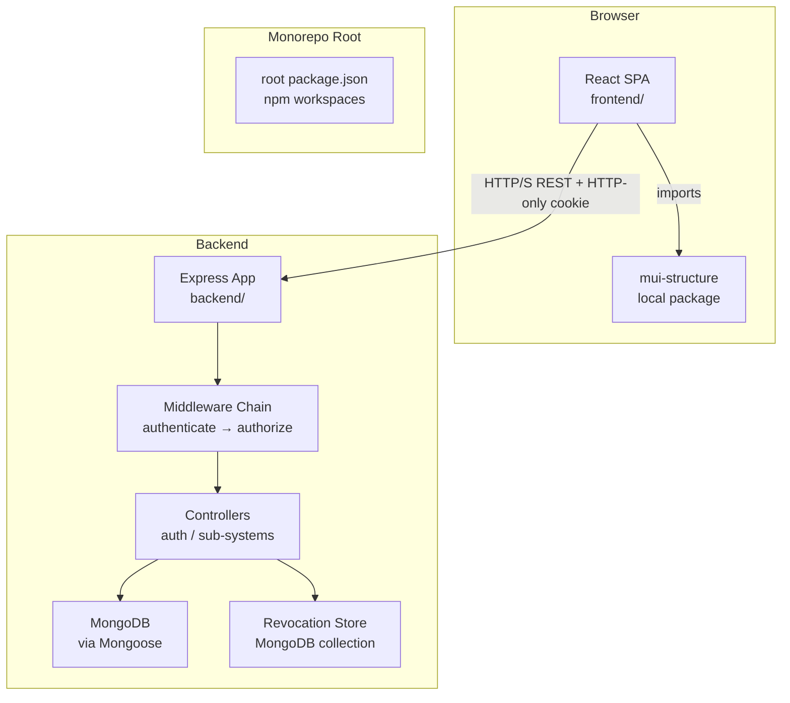
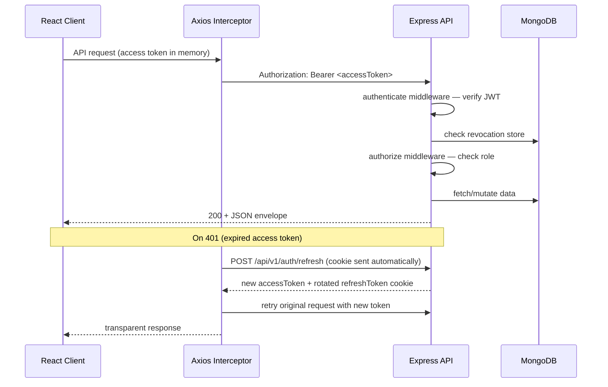
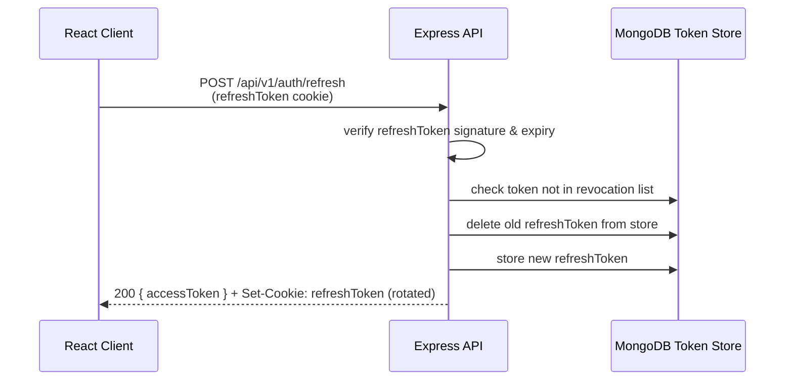

# Design Document: Central Admin Dashboard

## Overview

The Central Admin Dashboard is a MERN-stack monorepo application that unifies six campus sub-systems under a single authenticated interface. The system is split into three independently deployable packages:

- **`frontend/`** — React 18 SPA built with Vite, using MUI components from `mui-structure/`
- **`mui-structure/`** — Shared MUI theme, design tokens, and layout shell components published as a local workspace package
- **`backend/`** — Express 4 REST API backed by MongoDB, handling authentication, RBAC, and sub-system routing

Authentication uses a dual-token JWT strategy: a short-lived access token held in memory (React state/context) and a long-lived refresh token stored in an HTTP-only `SameSite=Strict` cookie. This approach eliminates XSS exposure of the refresh token while avoiding CSRF risk on the refresh endpoint. Token rotation is applied on every `/api/v1/auth/refresh` call; revoked tokens (access tokens at logout, old refresh tokens) are tracked in a MongoDB-backed revocation store.

All API routes are prefixed `/api/v1/` and return a consistent JSON envelope `{ success, data, message }`. RBAC is enforced by a two-middleware chain on every protected route: `authenticate` (verifies the access token and populates `req.user`) followed by `authorize(...roles)` (checks the role against a static permission matrix).

---

## Architecture

### High-Level Diagram



### Request Flow — Authenticated API Call



### Token Refresh Sequence



---

## Components and Interfaces

### Monorepo Folder Structure

```
central-admin-dashboard/
├── package.json                  # root — npm workspaces, dev/test/install:all scripts
├── .env.example                  # all required env vars documented
├── .gitignore
│
├── frontend/
│   ├── package.json              # "name": "@project/frontend"
│   ├── vite.config.js
│   ├── index.html
│   └── src/
│       ├── main.jsx
│       ├── App.jsx               # BrowserRouter + route tree
│       ├── api/
│       │   └── axiosInstance.js  # axios with interceptors
│       ├── context/
│       │   └── AuthContext.jsx   # AuthProvider, useAuth hook
│       ├── routes/
│       │   ├── ProtectedRoute.jsx
│       │   └── RoleRoute.jsx
│       ├── pages/
│       │   ├── LoginPage.jsx
│       │   ├── UnauthorizedPage.jsx
│       │   └── dashboard/
│       │       ├── DashboardHome.jsx
│       │       ├── MinimartPage.jsx
│       │       ├── ComplaintPage.jsx
│       │       ├── DormitoryPage.jsx
│       │       ├── LaundryPage.jsx
│       │       └── WaterStationPage.jsx
│       └── features/
│           └── auth/
│               ├── LoginForm.jsx
│               └── authService.js
│
├── mui-structure/
│   ├── package.json              # "name": "@project/mui-structure"
│   ├── src/
│   │   ├── index.js              # barrel export
│   │   ├── theme/
│   │   │   └── theme.js          # createTheme() configuration
│   │   ├── tokens/
│   │   │   └── designTokens.js   # colors, spacing, typography constants
│   │   └── components/
│   │       ├── UIShell.jsx       # root layout wrapper
│   │       ├── Sidebar.jsx       # persistent nav drawer
│   │       └── Topbar.jsx        # app bar with user info + logout
│
└── backend/
    ├── package.json              # "name": "@project/backend"
    ├── src/
    │   ├── app.js                # Express factory, middleware registration
    │   ├── server.js             # HTTP server entry point
    │   ├── config/
    │   │   └── env.js            # validated env config (dotenv + joi)
    │   ├── db/
    │   │   └── connection.js     # Mongoose connect
    │   ├── models/
    │   │   ├── User.js
    │   │   └── RevokedToken.js
    │   ├── middleware/
    │   │   ├── authenticate.js   # verify JWT, populate req.user
    │   │   ├── authorize.js      # RBAC role check
    │   │   ├── validate.js       # Joi/Zod schema validation wrapper
    │   │   └── errorHandler.js   # global error handler
    │   ├── routes/
    │   │   ├── index.js          # mount /api/v1/* routers
    │   │   └── auth.routes.js
    │   ├── controllers/
    │   │   └── auth.controller.js
    │   ├── services/
    │   │   └── token.service.js  # sign / verify / revoke tokens
    │   └── validators/
    │       └── auth.validators.js # Joi schemas for request bodies
```

### Backend Express Application (`app.js`)

```
helmet()          — security headers
cors()            — configured origin whitelist
express.json()    — body parsing
cookieParser()    — parse HTTP-only cookies
morgan()          — request logging
/api/v1 router    — versioned route mount
404 handler       — catches unmatched routes → standard envelope
errorHandler      — global error middleware
```

### API Route Map

| Method | Path                    | Middleware                                                 | Controller     | Req. |
| ------ | ----------------------- | ---------------------------------------------------------- | -------------- | ---- |
| POST   | `/api/v1/auth/register` | validate(registerSchema), authenticate, authorize('admin') | `registerUser` | 1    |
| POST   | `/api/v1/auth/login`    | validate(loginSchema)                                      | `loginUser`    | 2    |
| POST   | `/api/v1/auth/refresh`  | —                                                          | `refreshToken` | 3    |
| POST   | `/api/v1/auth/logout`   | authenticate                                               | `logoutUser`   | 4    |

> All protected sub-system routes follow the pattern: `authenticate` → `authorize(...roles)` → controller.

### Frontend Route Structure (React Router v6)

```
/login                           LoginPage  (public)
/unauthorized                    UnauthorizedPage (public)
/                                ProtectedRoute (requires auth)
  └── /dashboard                 UIShell layout
        ├── index                DashboardHome
        ├── minimart             MinimartPage      (admin, staff)
        ├── complaint            ComplaintPage     (admin, staff, student)
        ├── dormitory            DormitoryPage     (admin, staff, student)
        ├── laundry              LaundryPage       (admin, staff, student)
        └── water-station        WaterStationPage  (admin, staff, student)
```

`ProtectedRoute` — checks `auth.user` from `AuthContext`; redirects to `/login?redirect=<path>` if unauthenticated.  
`RoleRoute` — wraps role-restricted pages; redirects to `/unauthorized` if role not permitted.

### AuthContext Interface

```js
// context/AuthContext.jsx
const AuthContext = {
  user: { id, name, email, role } | null,
  accessToken: string | null,          // held in React state, never localStorage
  login(credentials) → Promise<void>,  // calls /api/v1/auth/login, sets state
  logout() → Promise<void>,            // calls /api/v1/auth/logout, clears state
  refreshAccessToken() → Promise<string>, // called by Axios interceptor
}
```

### Axios Interceptor Strategy

The `axiosInstance` in `frontend/src/api/axiosInstance.js` mounts two interceptors:

1. **Request interceptor** — attaches `Authorization: Bearer <accessToken>` from `AuthContext` before every request.
2. **Response interceptor** — on `401` response, calls `POST /api/v1/auth/refresh` (cookie sent automatically by the browser), stores the new access token in `AuthContext`, then retries the original request once. If refresh also fails (e.g., expired refresh token), the interceptor calls `logout()` and navigates to `/login`.

A `_retry` flag on the original request config prevents infinite retry loops.

### MUI Structure Package Interfaces

**`theme.js`** — exports a single MUI `createTheme()` object consumed by `ThemeProvider` in the frontend's `App.jsx`.

**`designTokens.js`** — exports a plain JS constants object:

```js
export const COLORS = { primary: '#1565C0', secondary: '#FF6F00', ... };
export const SPACING = { xs: 4, sm: 8, md: 16, lg: 24, xl: 32 };
export const TYPOGRAPHY = { fontFamily: '"Inter", sans-serif', sizes: { ... } };
```

**`UIShell`** — accepts `{ children }`. Renders `<Box sx={{ display: 'flex' }}>` containing `<Sidebar>` and a main area with `<Topbar>` + `<Box component="main">{ children }`.

**`Sidebar`** — accepts `{ navItems, activeRoute }`. Renders an MUI `<Drawer variant="permanent">` on desktop (`≥768px`) and an `<Drawer variant="temporary">` on mobile. Nav items are filtered by role before being passed from the frontend.

**`Topbar`** — accepts `{ user, onLogout, onMenuOpen }`. Renders `<AppBar>` with user name/role chip and logout `<IconButton>`.

---

## Data Models

### User Schema (`models/User.js`)

```js
const UserSchema = new mongoose.Schema(
  {
    name: {
      type: String,
      required: true,
      trim: true,
      minlength: 1,
      maxlength: 100,
    },
    email: {
      type: String,
      required: true,
      unique: true, // MongoDB unique index (case-insensitive collation)
      lowercase: true, // normalised before save
      trim: true,
    },
    passwordHash: {
      type: String,
      required: true,
      select: false, // never returned in queries by default
    },
    role: {
      type: String,
      enum: ['admin', 'staff', 'student'],
      required: true,
    },
  },
  { timestamps: true },
);

// Collation index for case-insensitive unique email enforcement
UserSchema.index({ email: 1 }, { unique: true, collation: { locale: 'en', strength: 2 } });
```

### RevokedToken Schema (`models/RevokedToken.js`)

```js
const RevokedTokenSchema = new mongoose.Schema({
  token: {
    type: String,
    required: true,
    unique: true,
  },
  tokenType: {
    type: String,
    enum: ['access', 'refresh'],
    required: true,
  },
  expiresAt: {
    type: Date,
    required: true,
    index: { expireAfterSeconds: 0 }, // MongoDB TTL index — auto-prunes expired entries
  },
});
```

> The TTL index on `expiresAt` means the MongoDB background thread automatically removes entries once the token's natural expiry has passed — keeping the revocation store bounded in size.

### JWT Payload Shape

```js
// Access Token payload (signed, 15 min expiry)
{ sub: userId, role: 'admin'|'staff'|'student', type: 'access' }

// Refresh Token payload (signed, 7 day expiry)
{ sub: userId, jti: uuid_v4, type: 'refresh' }
```

The `jti` (JWT ID) field on refresh tokens enables per-token revocation. On rotation, the old token's `jti` is written to `RevokedToken` before the new token is issued.

### Token Service Interface (`services/token.service.js`)

```js
signAccessToken(userId, role)       → string
signRefreshToken(userId)            → string
verifyAccessToken(token)            → payload | throws
verifyRefreshToken(token)           → payload | throws
revokeAccessToken(token, expiresAt) → Promise<void>
revokeRefreshToken(jti, expiresAt)  → Promise<void>
isRevoked(tokenOrJti)               → Promise<boolean>
```

---

## RBAC Permission Matrix

### Role Definitions

| Role      | Description                                                                         |
| --------- | ----------------------------------------------------------------------------------- |
| `admin`   | Full access to all endpoints and UI routes, including user management               |
| `staff`   | Operational access to all sub-system views; no user management                      |
| `student` | Personal-use access to own records in: Complaint, Dormitory, Laundry, Water Station |

### API Permission Matrix

| Endpoint Category                    | admin | staff | student       |
| ------------------------------------ | ----- | ----- | ------------- |
| `POST /auth/register`                | ✅    | ❌    | ❌            |
| `POST /auth/login`                   | ✅    | ✅    | ✅            |
| `POST /auth/refresh`                 | ✅    | ✅    | ✅            |
| `POST /auth/logout`                  | ✅    | ✅    | ✅            |
| User management (`/api/v1/users/**`) | ✅    | ❌    | ❌            |
| Minimart/POS endpoints               | ✅    | ✅    | ❌            |
| Complaint endpoints (own)            | ✅    | ✅    | ✅ (own only) |
| Dormitory endpoints (own)            | ✅    | ✅    | ✅ (own only) |
| Laundry endpoints (own)              | ✅    | ✅    | ✅ (own only) |
| Water Station endpoints (own)        | ✅    | ✅    | ✅ (own only) |

### UI Sidebar Navigation Matrix

| Sidebar Link          | admin | staff | student |
| --------------------- | ----- | ----- | ------- |
| Admin Dashboard       | ✅    | ❌    | ❌      |
| Minimart/POS          | ✅    | ✅    | ❌      |
| Complaint             | ✅    | ✅    | ✅      |
| Dormitory Reservation | ✅    | ✅    | ✅      |
| Laundry               | ✅    | ✅    | ✅      |
| Water Station         | ✅    | ✅    | ✅      |

### Authorize Middleware Pattern

```js
// middleware/authorize.js
const authorize =
  (...allowedRoles) =>
  (req, res, next) => {
    if (!allowedRoles.includes(req.user?.role)) {
      return res.status(403).json({
        success: false,
        data: null,
        message: 'Forbidden: insufficient permissions',
      });
    }
    next();
  };
```

---

## Correctness Properties

_A property is a characteristic or behavior that should hold true across all valid executions of a system — essentially, a formal statement about what the system should do. Properties serve as the bridge between human-readable specifications and machine-verifiable correctness guarantees._

**Property Reflection Summary:** After reviewing all acceptance criteria in the prework analysis, the following redundancies were eliminated before writing properties:

- Requirements 1.3, 1.4, and 1.5 (missing fields, format errors, invalid role) all test input validation — consolidated into Property 1.
- Requirements 2.2 and 2.3 (wrong email vs. wrong password) both test the non-revealing rejection message — consolidated into Property 3.
- Requirements 5.2, 5.3, 5.5, 5.6, and 5.7 all test RBAC enforcement on protected endpoints — consolidated into Property 7.
- Requirements 6.2, 6.3, and 6.4 all test sidebar nav filtering by role — consolidated into Property 8.
- Requirements 8.2, 8.3, and 8.6 all test the standard JSON envelope — consolidated into Property 9.
- Requirements 3.3, 5.4, 5.5, 5.6, 5.7, 2.6, 2.7, 6.2, 6.3, 6.4 are edge cases or sub-cases already covered by the consolidated properties above.

---

### Property 1: Registration Rejects and Reports Invalid Inputs

_For any_ registration request where at least one field is absent OR fails constraint validation (name > 100 chars, invalid email format, password < 8 chars, role outside the permitted enum), the Auth_Service SHALL return a `4xx` response that identifies each failing field by name, and SHALL NOT create a new User record in the database.

**Validates: Requirements 1.2, 1.3, 1.4, 1.5**

---

### Property 2: Password Storage is Never Plaintext

_For any_ successfully registered user, the value stored in `passwordHash` SHALL NOT equal the plaintext password submitted during registration, and SHALL be verifiable by `bcrypt.compare(plaintext, hash) === true`.

**Validates: Requirements 1.6**

---

### Property 3: Login Credential Rejection is Non-Revealing

_For any_ login request made with a non-existent email, and _for any_ login request made with an existing email paired with an incorrect password, the Auth_Service SHALL return a `401 Unauthorized` response where the `message` field is the same string in both cases, containing no information that distinguishes the two failure modes.

**Validates: Requirements 2.2, 2.3**

---

### Property 4: Token Expiry Claims Stay Within Defined Bounds

_For any_ successful login or token refresh, the issued access token's `exp - iat` duration SHALL be between 60 seconds and 3600 seconds (1–60 minutes), and the issued refresh token's `exp - iat` duration SHALL be between 6 days and 8 days.

**Validates: Requirements 2.4, 3.1**

---

### Property 5: Refresh Token Rotation Invalidates the Old Token

_For any_ valid refresh token used to call `/api/v1/auth/refresh`, the response SHALL contain a new access token and set a new refresh token cookie, AND a subsequent call to `/api/v1/auth/refresh` with the original refresh token SHALL return `401 Unauthorized`, proving the old token has been revoked.

**Validates: Requirements 3.1, 3.2**

---

### Property 6: Revoked Access Token is Rejected on Protected Endpoints

_For any_ access token that has been submitted to `/api/v1/auth/logout`, any subsequent request to a protected endpoint carrying that same token SHALL be rejected with `401 Unauthorized`, regardless of whether the token's natural `exp` time has elapsed.

**Validates: Requirements 4.1, 4.2**

---

### Property 7: RBAC Returns 403 for Every Unauthorised Role

_For any_ protected API endpoint that defines a permitted role set `R`, and _for any_ authenticated request whose token carries role `r` where `r ∉ R`, the RBAC middleware SHALL return `403 Forbidden` and SHALL NOT invoke the downstream controller function.

**Validates: Requirements 5.2, 5.3, 5.5, 5.6, 5.7**

---

### Property 8: Sidebar Navigation Links Exactly Match the User's Role

_For any_ authenticated user with role `r ∈ {admin, staff, student}`, the sidebar navigation links rendered by `UIShell` SHALL contain exactly the set of links defined in the UI permission matrix for role `r` — no extra links and no missing permitted links.

**Validates: Requirements 6.2, 6.3, 6.4**

---

### Property 9: Every API Response Uses the Standard Envelope

_For any_ HTTP request to any route under `/api/v1/`, the response body SHALL be a JSON object containing exactly three top-level fields: `success` (boolean), `data` (object, array, or null), and `message` (string), whether the request succeeds, fails validation, encounters an RBAC error, hits a missing route, or triggers an unhandled exception.

**Validates: Requirements 8.2, 8.3, 8.6**

---

### Property 10: Validation Error Responses Identify Each Failing Field

_For any_ request body containing one or more fields with invalid values, the `400 Bad Request` response's `data` field SHALL contain an errors array where each entry includes the name of the failing field and a human-readable description of the violated constraint.

**Validates: Requirements 1.3, 1.4, 8.5**

---

### Property 11: Topbar Always Displays the Authenticated User's Name and Role

_For any_ authenticated user object with arbitrary `name` and `role` values, the `Topbar` component SHALL render text containing that user's name and role somewhere in the app bar, with no substitution or truncation of the provided values.

**Validates: Requirements 6.6**

---

### Property 12: Unauthenticated Access to Protected Routes Redirects to Login

_For any_ protected frontend route path, attempting to render that route without an authenticated session SHALL redirect the browser to `/login` and SHALL preserve the originally requested path as a redirect query parameter (e.g., `/login?redirect=/dashboard/laundry`).

**Validates: Requirements 7.5**

---

## Error Handling

### Backend Error Strategy

All controllers are wrapped in a `try/catch` that passes errors to the global `errorHandler` middleware. The global handler applies the following rules:

| Error Type                 | HTTP Status | `success` | `message`                             |
| -------------------------- | ----------- | --------- | ------------------------------------- |
| Validation error (Joi/Zod) | 400         | false     | Field-level error array               |
| JWT verification failure   | 401         | false     | "Invalid or expired token"            |
| Revoked token              | 401         | false     | "Token has been revoked"              |
| Insufficient role          | 403         | false     | "Forbidden: insufficient permissions" |
| Duplicate key (email)      | 409         | false     | "Email already registered"            |
| Unhandled / unexpected     | 500         | false     | "An unexpected error occurred"        |

Stack traces, file paths, and internal identifiers are **never** included in the `message` field of any response. Full error details are written to the server-side logger (`winston` or `morgan` + `console.error` in development).

### Frontend Error Strategy

- **Axios interceptor** handles `401` transparently via refresh flow before surfacing to the UI.
- **AuthContext** stores `error` state that pages can consume via `useAuth()`.
- Logout timeout (10 s) is implemented with `Promise.race([logoutCall, timeout])`. On timeout or network failure, a MUI `<Snackbar>` notification is shown and the user remains on the current page (Req. 6.8).
- Sub-system pages render MUI `<Alert severity="error">` for API-level errors.

### Cookie Security Configuration

```js
// Set on login and refresh responses
res.cookie('refreshToken', token, {
  httpOnly: true,
  secure: process.env.NODE_ENV === 'production', // HTTPS only in prod
  sameSite: 'Strict',
  maxAge: 7 * 24 * 60 * 60 * 1000, // 7 days in ms
  path: '/api/v1/auth', // scoped to auth routes only
});
```

Scoping the cookie `path` to `/api/v1/auth` ensures the browser only sends it on auth-related requests, reducing the exposure surface.

---

## Testing Strategy

### Dual Testing Approach

The project uses a combination of example-based unit tests and property-based tests:

- **Unit / integration tests** (Jest + Supertest for backend; Vitest + React Testing Library for frontend): verify specific scenarios, error paths, and integration between components.
- **Property-based tests** (fast-check for both backend and frontend): verify universal properties across hundreds of generated inputs, catching edge cases that hand-written examples miss.

### Property-Based Testing Library

**[fast-check](https://fast-check.dev/)** is used for both `backend/` and `frontend/` packages. It integrates natively with Jest and Vitest, supports arbitrary generators for strings, objects, UUIDs, and custom types, and runs 100 iterations per property by default (configurable).

Each property test references the design document property it validates using the tag comment:

```js
// Feature: central-admin-dashboard, Property 1: Registration rejects invalid inputs
```

### Property Test Configurations

Each test is tagged with:

```js
// Feature: central-admin-dashboard, Property N: <property title>
```

**Property 1 — Registration Rejects and Reports Invalid Inputs**  
Generator: `fc.record({ name, email, password, role })` where at least one field is sampled from an invalid domain (name > 100 chars, malformed email, password < 8 chars, invalid role string, or field omitted entirely).  
Assert: response status is `4xx` AND no new User document exists in the test DB AND each failing field is named in the errors array.  
Runs: 100 iterations minimum.

**Property 2 — Password Storage is Never Plaintext**  
Generator: `fc.record({ name: fc.string(), email: fc.emailAddress(), password: fc.string({ minLength: 8 }), role: fc.constantFrom('admin','staff','student') })`.  
Assert: fetched `user.passwordHash !== password` AND `await bcrypt.compare(password, user.passwordHash) === true`.  
Runs: 100 iterations minimum.

**Property 3 — Login Credential Rejection is Non-Revealing**  
Generator: two cases — (a) `fc.emailAddress()` not seeded in DB paired with any password; (b) seeded email paired with `fc.string()` that differs from the actual password.  
Assert: both produce `401` responses with identical `message` strings.  
Runs: 100 iterations minimum.

**Property 4 — Token Expiry Claims Stay Within Defined Bounds**  
Generator: arbitrary valid registered user credentials.  
Assert: decoded access token `exp - iat` ∈ [60, 3600] seconds; decoded refresh token `exp - iat` ∈ [518400, 691200] seconds (6–8 days).  
Runs: 100 iterations minimum.

**Property 5 — Refresh Token Rotation Invalidates the Old Token**  
Generator: arbitrary valid user sessions; obtain refresh token cookie via login.  
Assert: first `POST /api/v1/auth/refresh` returns `200` with new access token and new cookie; second call with original cookie returns `401`.  
Runs: 100 iterations minimum.

**Property 6 — Revoked Access Token is Rejected on Protected Endpoints**  
Generator: arbitrary valid sessions; call logout to revoke access token.  
Assert: subsequent `GET/POST` to any protected endpoint with the revoked token returns `401`.  
Runs: 100 iterations minimum.

**Property 7 — RBAC Returns 403 for Every Unauthorised Role**  
Generator: `fc.tuple(fc.constantFrom(...protectedEndpoints), fc.constantFrom('admin','staff','student'))` filtered to pairs where role is not in endpoint's permitted set.  
Assert: response is `403` and any observable controller side-effect (DB mutation, cookie change) does not occur.  
Runs: 100 iterations minimum.

**Property 8 — Sidebar Navigation Links Exactly Match the User's Role**  
Generator: `fc.constantFrom('admin','staff','student')` → construct corresponding user object.  
Assert: rendered sidebar nav items (by `data-testid` or link text) exactly equal the expected set from the permission matrix — set equality, not subset.  
Runs: 100 iterations minimum (3 distinct role cases, 33+ iterations each).

**Property 9 — Every API Response Uses the Standard Envelope**  
Generator: arbitrary HTTP requests (valid, invalid, unknown routes) across all mounted routes.  
Assert: every response body is parseable JSON with `typeof success === 'boolean'`, `data === null || typeof data === 'object'`, `typeof message === 'string'`.  
Runs: 100 iterations minimum.

**Property 10 — Validation Error Responses Identify Each Failing Field**  
Generator: request bodies with one or more specific fields assigned invalid values (tracked in generator metadata).  
Assert: `response.body.data.errors` is an array where every invalid field from the generator appears with a non-empty `message`.  
Runs: 100 iterations minimum.

**Property 11 — Topbar Always Displays the Authenticated User's Name and Role**  
Generator: `fc.record({ name: fc.string({ minLength: 1, maxLength: 100 }), role: fc.constantFrom('admin','staff','student') })`.  
Assert: rendered `Topbar` HTML contains the user's `name` and `role` as text nodes — no truncation or substitution.  
Runs: 100 iterations minimum.

**Property 12 — Unauthenticated Access to Protected Routes Redirects to Login**  
Generator: `fc.webPath()` representing arbitrary protected route paths.  
Assert: rendering `ProtectedRoute` without auth context redirects to `/login` and the `redirect` query param equals the original path.  
Runs: 100 iterations minimum.

### Unit Test Coverage Targets

| Layer                | Focus                                                                              |
| -------------------- | ---------------------------------------------------------------------------------- |
| `token.service.js`   | sign, verify, revoke, isRevoked (all branches)                                     |
| `authenticate.js`    | missing header, malformed token, expired token, revoked token                      |
| `authorize.js`       | all three roles against all permission categories                                  |
| `auth.controller.js` | all success paths + all documented error responses                                 |
| `AuthContext`        | login, logout, refresh flow, error states                                          |
| `ProtectedRoute`     | redirect when unauthenticated, render when authenticated, redirect param preserved |
| `RoleRoute`          | redirect to `/unauthorized` for wrong role                                         |
| `Sidebar`            | correct nav items per role, active link distinction                                |
| `Topbar`             | user name/role display, logout button interaction                                  |
| `UIShell`            | responsive drawer variant at <768px and ≥768px viewport                            |
| `axiosInstance`      | retry-once on 401, redirect to `/login` on refresh failure, `_retry` guard         |

### Integration Tests

Supertest integration tests exercise the full Express middleware stack against a test MongoDB instance (via `mongodb-memory-server`):

- Auth flow end-to-end (register → login → refresh → logout → rejected retry)
- RBAC enforcement on every protected route category
- Standard envelope format on all routes including 404 and 500 paths
